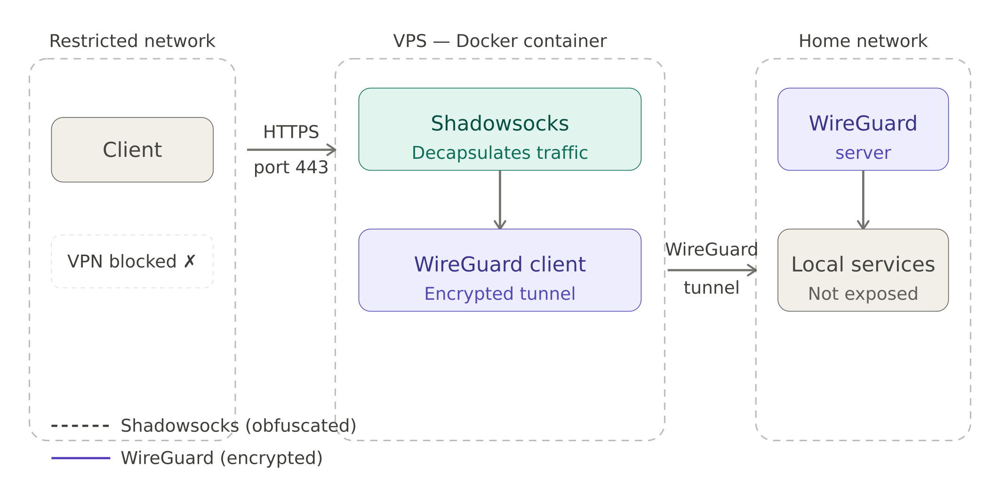

# ShadowSocks — WireGuard tunnel

A Docker container that chains a Shadowsocks proxy to a WireGuard VPN hosted at home.

## Why

Two problems, one container:
1. Some networks block VPN traffic — Shadowsocks disguises it as regular HTTPS traffic
2. I want access to services running at home that aren't exposed to the internet

## How it works

Traffic enters the container through Shadowsocks, gets decapsulated, then forwarded through a WireGuard tunnel back to my home network.
The obfuscation is handled by [v2ray-plugin](https://github.com/shadowsocks/v2ray-plugin), which wraps Shadowsocks traffic as WebSocket over TLS. To a firewall, it looks like regular HTTPS traffic on port 443.

<p align="center">
  
</p>

## Stack

| Component   | Technology |
|-------------|------------|
| Proxy       | Shadowsocks |
| VPN         | WireGuard |
| Container   | Docker |
| CI/CD       | GitHub Actions |
| Registry    | Docker Hub |
| Deployment  | n8n (webhook → Watchtower) |

## Run locally

```bash
docker run -d \
  -e SS_PASSWORD=CHANGEME \
  -e SS_METHOD=aes-256-gcm \
  -e PLUGIN_OPTS="server;mode=websocket;path=/ssws;host=yourdomain.com" \
  -e VIRTUAL_PORT=XXXX \
  -v /path/to/wg0.conf:/etc/wireguard/wg0.conf \
  --cap-add NET_ADMIN \
  nem0oo/shadowsocks-wireguard:latest
```

> ⚠️ This container requires `NET_ADMIN` capability to manage the WireGuard interface.

## CI/CD

### Push to `main`

1. Tag the current `latest` image as `previous` (for rollback)
2. Build and push the new `latest` image to Docker Hub
3. Trigger deployment via n8n webhook

> No automated test as testing VPN/tunneled connections is not practical.

### Required secrets

| Secret | Description |
|--------|-------------|
| `DOCKERHUB_USERNAME` | Docker Hub username |
| `DOCKERHUB_TOKEN`    | Docker Hub access token |
| `N8N_WEBHOOK_ID`     | n8n webhook ID triggering the redeployment |